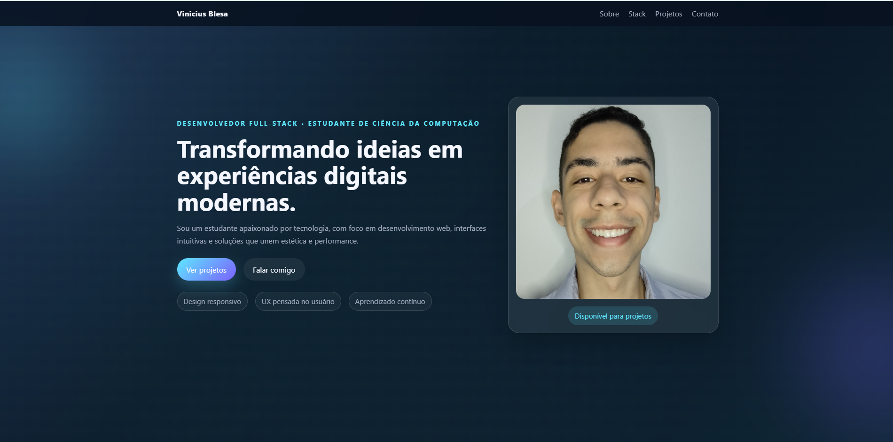

# 💼 Portfólio - Vinicius Blesa

Meu portfólio profissional desenvolvido para apresentar minha trajetória, habilidades e principais projetos na área de desenvolvimento de software.

O objetivo deste projeto é reunir em um único lugar informações sobre minha formação, tecnologias que utilizo, projetos desenvolvidos e formas de contato.

---

# 📷 Preview

> Adicione aqui um print da página inicial.

Exemplo:



---

# ✨ Funcionalidades

- Layout moderno e responsivo
- Navegação suave entre as seções
- Menu fixo com destaque da seção atual
- Animações ao rolar a página
- Botão para voltar ao topo
- Sessão "Sobre Mim"
- Sessão de Tecnologias
- Exibição dos principais projetos
- Formulário de contato com validação
- Links para GitHub, LinkedIn e Email

---

# 🚀 Tecnologias Utilizadas

- HTML5
- CSS3
- JavaScript (ES6)
- Git
- GitHub

---

# 📁 Estrutura do Projeto

```
Portfolio-Vinicius-Blesa
│
├── img/
├── index.html
├── style.css
├── script.js
└── README.md
```

---

# 📱 Responsividade

O projeto foi desenvolvido utilizando o conceito de **Mobile First Adaptado**, funcionando em:

- Desktop
- Notebook
- Tablet
- Smartphone

---

# 🎯 Objetivo

Este portfólio foi criado para:

- apresentar minha evolução como desenvolvedor;
- divulgar meus principais projetos;
- servir como cartão de visitas profissional;
- facilitar o contato com recrutadores e empresas.

---

# 📂 Projetos em destaque

## 🐉 Site Temático Dragon Ball

Projeto focado em identidade visual, experiência do usuário e design moderno.

---

## 🎓 Gestão de Alunos

Sistema web para gerenciamento de alunos utilizando JavaScript.

---

## 🚗 Car Consórcios

Landing Page desenvolvida em React + Vite.

---

## 💻 Quadro de Talentos

Projeto desenvolvido durante treinamentos em React com foco em SPA e consumo de APIs.

---

# ⭐ Caso tenha gostado do projeto

Se este projeto foi útil ou interessante para você, deixe uma ⭐ no repositório.